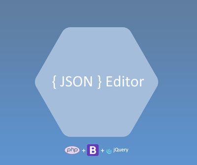

# JSON-Web-Editor
This is a small tool for your JSON objects and this tool is written by **PHP language**. you can manipulating your JSON data via a web editor.

## How to install

Download the project and put it at the root of your project.

## Usage

By default, you must put your JSON files in the following path:
`/report`

You can change the default path using the `config.php` edit and put your desired path in the variable **$json_dir**.

Enjoy and if you have an idea to improve this tool please contact me.
